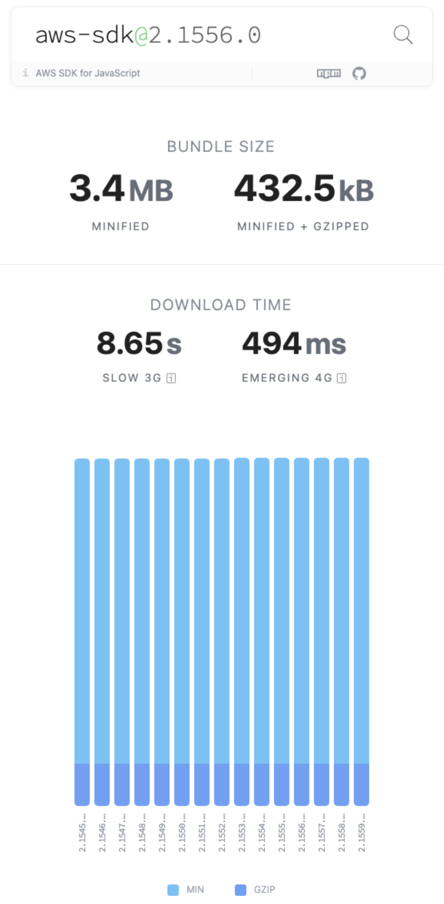
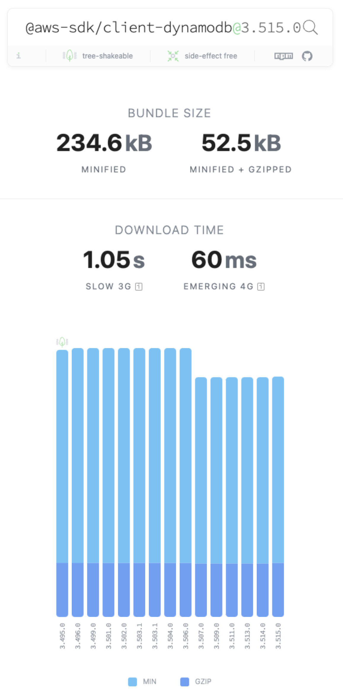

# Performance > Bundle sizes

In the context of web development, a JavaScript application bundle refers to a single file or a collection of files that contain all the necessary code needed to run a web application. The bundling process, using tools like Webpack, Rollup, Parcel or esbuild, combines all the application files into a smaller number of files (often just one or a few) that can be easily loaded by the web browser.

Here are some of the key benefits of bundling:

- **Improved Performance**: Combining multiple files into one reduces the number of HTTP requests needed to fetch resources, which can improve loading times, especially on slower networks.
- **Code Organization**: Bundling can help organize your codebase by allowing you to split your code into smaller, more manageable modules without sacrificing performance.
- **Code Optimization**: Bundling can also include optimizations such as minification (removing unnecessary characters like white spaces and comments) and tree shaking (removing unused code) to further reduce the bundle size.
- **Caching**: Bundling can improve caching efficiency, as the browser only needs to cache less files, reducing the likelihood of cache fragmentation.
- **Compatibility**: You can optionally use the latest features of JavaScript or TypeScript language in your source code, and target your bundle for older runtimes which do not use them. And your bundler will provide polyfills for those features.

Although bundling was invented to reduce file count and size on the frontend, it is helpful in the backend too. Just like browsers, the initialization time improves in the backend since runtime has to read just one bundle file and does not have to spend time in resolving dependencies. This helps reducing cold start times in Serverless Environment, like AWS Lambda. Bundling can also reduce deployment times, as there are fewer files to deploy.

The JS SDK v3 has smaller bundle sizes than those of v2, as it follows coding styles to enable dead code elimination. For example, we use named exports instead of default exports, i.e. export only the functions which need to be exposed. This makes it easier for tools to identify and remove unused code. We also use pure functions in the code base which does not have side effects. This makes it easier for tools to determine if a function is used or not, and safely remove unused functions.

The bundle sizes of AWS SDK for JavaScript can be verified from third party tools, like [BundlePhobia](https://bundlephobia.com/), which helps find overall performance impact of npm packages. For example, the below screenshots show that v2 package has bundle size of 3.4 MB, while v3 DynamoDB package has bundle size of 234.6 kB.

<!-- prettier-ignore-start -->
aws-sdk             |  @aws-sdk/client-dynamodb
:-------------------------:|:-------------------------:
  |   
<!-- prettier-ignore-end -->

```console
$ npm install aws-sdk@2.1557.0 esbuild@0.20.0 --save-exact

$ echo 'import { DynamoDB } from "aws-sdk";
const client = new DynamoDB();' > index.js

$ npx esbuild index.js --bundle --minify \
--main-fields=module,main --outfile=out.js

  out.js  3.2mb ⚠️

⚡ Done in 53ms
```

```console
$ npm install @aws-sdk/client-dynamodb@3.513.0 esbuild@0.20.0 --save-exact

$ echo 'import { DynamoDB } from "@aws-sdk/client-dynamodb";
const client = new DynamoDB();' > index.js

$ npx esbuild index.js --bundle --minify \
--main-fields=module,main --outfile=out.js

  out.js  214.2kb

⚡ Done in 37ms
```

Here, we compare the bundle sizes of two different applications containing equivalent code which imports DynamoDB client from AWS SDK for JavaScript and creates a client. The bundle size of application built using v2 is 3.2 MB, while the bundle size of equivalent application built using v3 is 214.2 kB.
