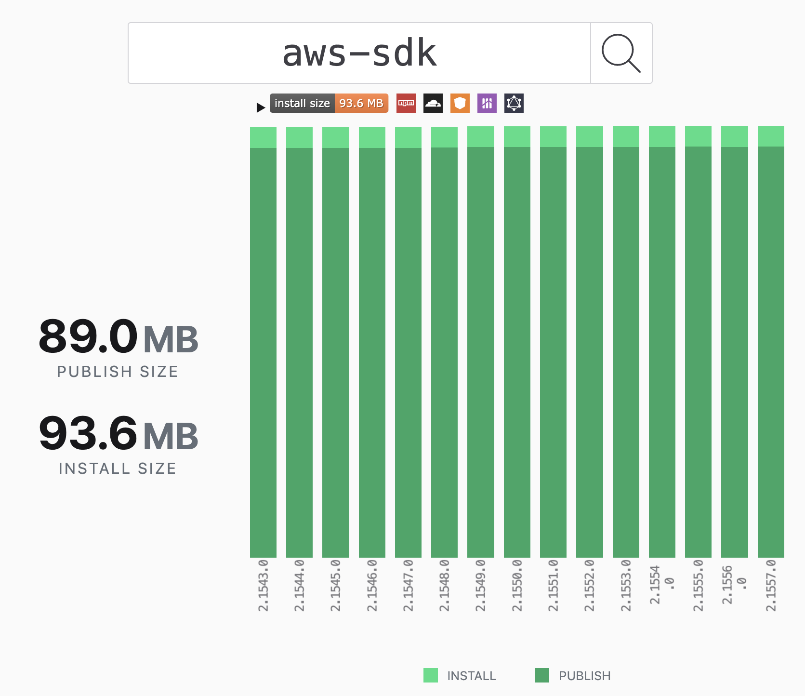

# Performance > Publish and Install sizes

A “publish size” of an npm package is the size of the source code published to npm. The "install size" of an npm package refers to the amount of disk space that will be used when the package is installed on your system. This includes not only the size of the package itself, but also any dependencies that it relies on. When you install an npm package, npm will download the package and all of its dependencies to a node_modules directory in your project, so the install size is the total size of all of these files combined.

If you import the entire SDK even if your application uses just a subset of SDK’s functionalities, it’ll increase application size. Your application may potentially exceed disk size quota in resource-constrained environments, like Serverless or IoT devices, blocking your application development. There are other performance and efficiency issues with large install sizes:

- **Installation Time**: Larger dependencies take longer to download and install, which can slow down the development process.
- **Resource Consumption**: Larger dependencies may consume more memory and CPU resources, affecting the scalability and efficiency of the application, especially in serverless environments.
- **Dependency Management**: Managing large dependencies can be more complex, as they may have their own dependencies and version requirements, leading to potential conflicts and issues.
- **Deployment Size**: Larger dependencies increase the size of deployment packages, which can be a concern for deployment pipelines and storage costs.

It's generally advisable to keep dependencies as small and as minimal as possible to improve the performance and maintainability of Node.js applications. In v3, we divided the JavaScript SDK core into multiple [modular packages](https://aws.amazon.com/blogs/developer/modular-packages-in-aws-sdk-for-javascript/) and publishing each service as its own package, thus reducing both the publish and install sizes.

The install and publish sizes of AWS SDK for JavaScript can be verified from third party tools, like [PackagePhobia](https://packagephobia.com/), which measures the actual byte size of the artifacts. For example, the below screenshots show that v2 package has install size of 93.6 MB, while v3 DynamoDB package has install size of 6.29 MB.

<!-- prettier-ignore-start -->
aws-sdk             |  @aws-sdk/client-dynamodb
:-------------------------:|:-------------------------:
  |   
<!-- prettier-ignore-end -->

The install size on disk can also be verified locally on your machine as follows:

```console
$ npm install aws-sdk@2.1557.0 --save-exact

$ du -sh node_modules
101M node_modules
```

```console
$ npm install @aws-sdk/client-dynamodb@3.513.0 --save-exact

$ du -sh node_modules
17M    node_modules
```

The install size on disk is larger, as it’s the actual size on disk which depends on how blocks are allocated. It may be different on your machine, but the relative difference between the sizes would be similar.

Most of AWS SDK for JavaScript applications use one to three clients. Even if you install the five most popular clients, the install size is less than a third of that in v2.

```console
$ npm install @aws-sdk/client-s3 @aws-sdk/client-kinesis \
  @aws-sdk/client-sns @aws-sdk/client-cloudwatch @aws-sdk/client-api-gateway

$ du -sh node_modules
30M    node_modules
```
